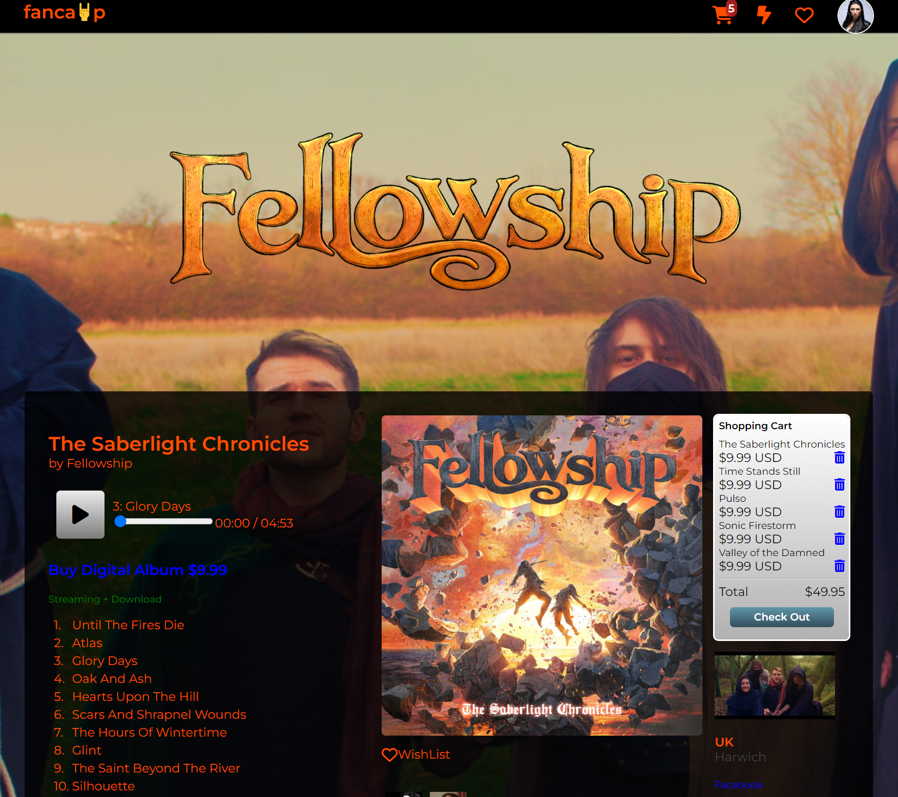
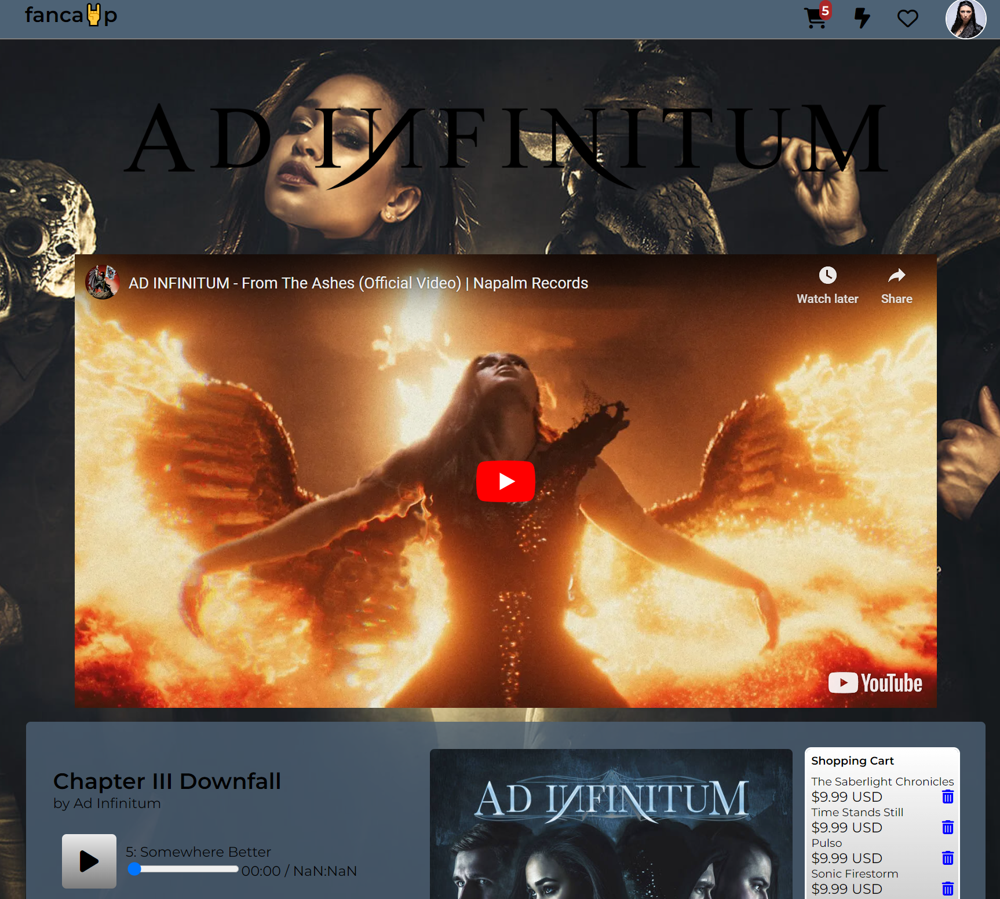

## FANCAMP

### ABOUT

Fancamp is a clone of bandcamp, with more of a metal music theme, built as a capstone project for my studies with App Academy. Building it has been a great learning experience about building a streaming service with social media aspects, that also allows a great deal of personalization. Bandcamp is a deceptively complex website. Moving forward as I prepare Fancamp to be a portfolio project I hope to incorporate more and more features.

Fancamp is currently hosted publicly at
https://fancamp.onrender.com




### TECHNOLOGIES

Technologies used to build this app include

*Python
*Flask
*SqlAlchemy
*WTForms
*Javascript
*React.js/Redux.js
*react-player


### LAUNCHING APP

To launch the app locally open two terminals.
In the first enter in the terminal 'flask run' to initiate the backend server.

In the second terminal cd into the 'react-app' directory and enter 'npm start' in the terminal to begin the front end server. This will get the app hosted locally.

Otherwise, you can use the app at
https://fancamp.onrender.com

### MINIMAL VIABLE PRODUCT

As much as I admire bandcamp, reproducing it in its entirety is a little out of scope for the time restraints of my capstone.

Tables that have full CRUD functionality are
Bands
Albums
Songs

Tables with partial CRUD
-Cart CRD
-Wishlist CRD
-Users CR
-Purchases CR

### BACKEND ROUTES

Albums
-Get all albums
-Delete by ID
-Get by ID
-Put by ID
-Post song by Album ID
-Edit song by Album and song id

Authentication
-authenticate
-login
-logout
-signup

Bands
-Get by id
-Delete by id
-Put by ID
-Get all bands
-Post band

Purchases
-Get user purchases
-Get all purchases

Songs
-Delete by ID

Wishlist
-Delete by ID
-Get by user id
-Delete all by user id
-Post wished item

### REDUX STATE SHAPE

```{
    session: {
        user: {}
    },
    albums: {
        singleAlbums: {},
        allAlbums: {}
    },
    purchases: {
        userPurchases: {},
        allPurchases: {}
    },
    bands: {
        singleBands: {},
        allBands: {}
    },
    users: {
     ...users
    },
    songs: {
        allSongs: [...]
    },
    wishlists: {
        userWishes: {}
    }
}

```
### FUTURE APP GOALS

In the future I hope to implement an audio player of my own and do away with react-player.





### ABOUT THE CREATOR

To learn more about me, please reach out and network. Looking forward to programming with you!

'Christian Ludwell'

Linked In
*https://www.linkedin.com/in/christian-ludwell-047b18247/

Github
*https://github.com/cludwell

Wellfound
*https://wellfound.com/u/chris-ludwell

Portfolio
*https://cludwell.github.io/
